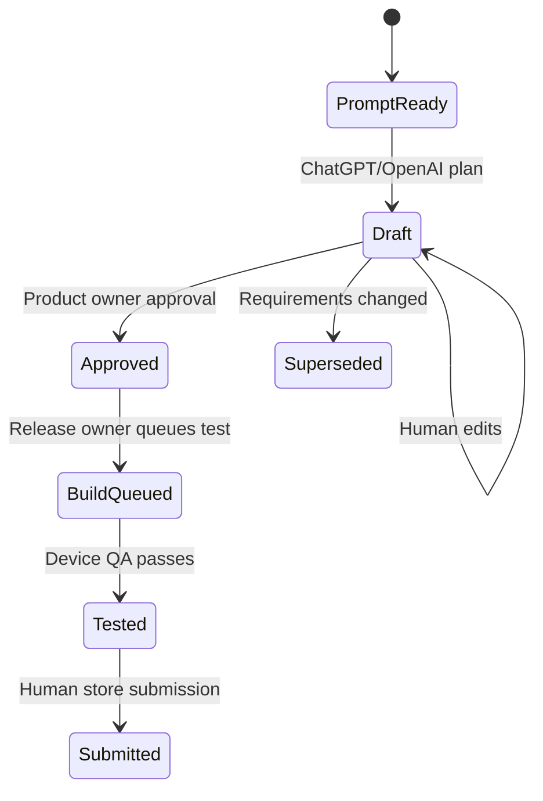

# Python + Supabase + Lovable architecture

## Responsibility map

| Layer | Owns | Must not receive |
|---|---|---|
| Lovable UI | Operator forms, authenticated portfolio views, plan/build status | Supabase service role, signing keys, OpenAI API key |
| Supabase | Auth, app/build/plan records, RLS, realtime status | Raw Apple `.p8`, Android keystore passwords |
| Python control plane | Validation, planning prompts, Supabase sync, GitHub dispatch, metadata generation | Public browser access without authentication |
| GitHub Environments | Per-app Apple/Google/signing/reviewer secrets | Lovable client access |
| macOS runner/Appflow | Native compilation and internal-test uploads | Cross-brand credentials outside the selected environment |
| ChatGPT/OpenAI API | Draft plan, backlog, QA/store copy questions | Signing credentials or unreviewed production authority |

## Local pilot

1. Create a dedicated Supabase project.
2. Run `docs/control-plane.sql` in the SQL editor.
3. Copy `.env.example` to `.env` outside version control and set the server values in your Windows PowerShell session.
4. Start Native Factory Studio.
5. Configure apps, then press **Sync apps to Supabase**.
6. In **Capacitor ready**, enter product goals and create a ChatGPT planning pack. Without API settings, Studio writes a prompt you can paste into ChatGPT. With `OPENAI_API_KEY` and an explicitly selected `OPENAI_MODEL`, the Python server writes the returned draft plan and syncs it to Supabase.

## Production hosting

Host the Python control plane on a private service such as Azure Container Apps, Google Cloud Run, Railway or Render. Put `SUPABASE_SERVICE_ROLE_KEY`, `OPENAI_API_KEY` and GitHub App credentials in that host's secret manager. Do not expose the current local Studio directly to the internet; it is intentionally bound to `127.0.0.1`.

The production Lovable UI should:

1. Use Supabase Auth with the public project URL and anon/publishable key.
2. Read only organisation-scoped app, plan and build-status rows allowed by RLS.
3. Send privileged commands to authenticated Python endpoints.
4. Let Python verify the signed-in user's organisation/role before syncing apps, calling OpenAI, dispatching GitHub or changing approval status.
5. Subscribe to build rows for realtime progress.

Before exposing any records, add organisations, memberships and RLS policies appropriate to your tenancy. The starter SQL intentionally creates no anonymous policies.

## Planning lifecycle

ChatGPT is a drafting partner, not an approver. Unknown data practices, regulated claims, account ownership, legal text and completed test results stay marked for human confirmation.

## Recommended next production module

Replace the local-only admin transport with an authenticated Python API and worker queue:

- `POST /v1/apps/{slug}/plans` — create prompt/draft;
- `POST /v1/apps/{slug}/sync` — validate and sync metadata;
- `POST /v1/apps/{slug}/builds` — create job and dispatch GitHub;
- `POST /v1/build-webhook` — update job status from GitHub;
- `POST /v1/apps/{slug}/approve` — role-gated plan/release approval.

Use idempotency keys for build requests and a GitHub App instead of long-lived personal access tokens once the pilot is proven.

